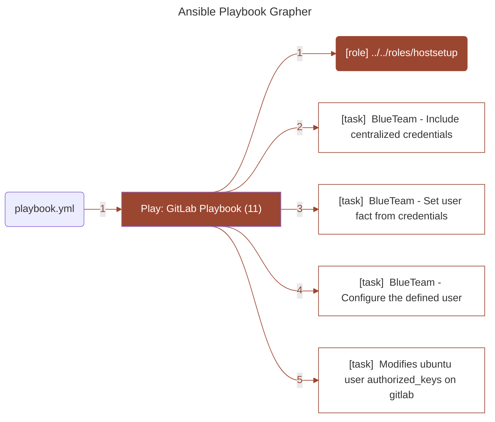

```mermaid
---
title: Ansible Playbook Grapher
---
%%{ init: { "flowchart": { "curve": "bumpX" } } }%%
flowchart LR
	%% Start of the playbook 'playbook.yml'
	playbook_95c705a2("playbook.yml")
		%% Start of the play 'Play: GitLab Playbook (11)'
		play_db9a822c["Play: GitLab Playbook (11)"]
		style play_db9a822c fill:#9b4631,color:#ffffff
		playbook_95c705a2 --> |"1"| play_db9a822c
		linkStyle 0 stroke:#9b4631,color:#9b4631
			%% Start of the role '../../roles/hostsetup'
			play_db9a822c --> |"1"| role_68a84917
			linkStyle 1 stroke:#9b4631,color:#9b4631
			role_68a84917("[role] ../../roles/hostsetup")
			style role_68a84917 fill:#9b4631,color:#ffffff,stroke:#9b4631
			%% End of the role '../../roles/hostsetup'
			task_3bfa0e80["[task]  BlueTeam - Include centralized credentials"]
			style task_3bfa0e80 stroke:#9b4631,fill:#ffffff
			play_db9a822c --> |"2"| task_3bfa0e80
			linkStyle 2 stroke:#9b4631,color:#9b4631
			task_ddf3068c["[task]  BlueTeam - Set user fact from credentials"]
			style task_ddf3068c stroke:#9b4631,fill:#ffffff
			play_db9a822c --> |"3"| task_ddf3068c
			linkStyle 3 stroke:#9b4631,color:#9b4631
			task_6b5f04df["[task]  BlueTeam - Configure the defined user"]
			style task_6b5f04df stroke:#9b4631,fill:#ffffff
			play_db9a822c --> |"4"| task_6b5f04df
			linkStyle 4 stroke:#9b4631,color:#9b4631
			task_55764626["[task]  Modifies ubuntu user authorized_keys on gitlab"]
			style task_55764626 stroke:#9b4631,fill:#ffffff
			play_db9a822c --> |"5"| task_55764626
			linkStyle 5 stroke:#9b4631,color:#9b4631
		%% End of the play 'Play: GitLab Playbook (11)'
	%% End of the playbook 'playbook.yml'


```