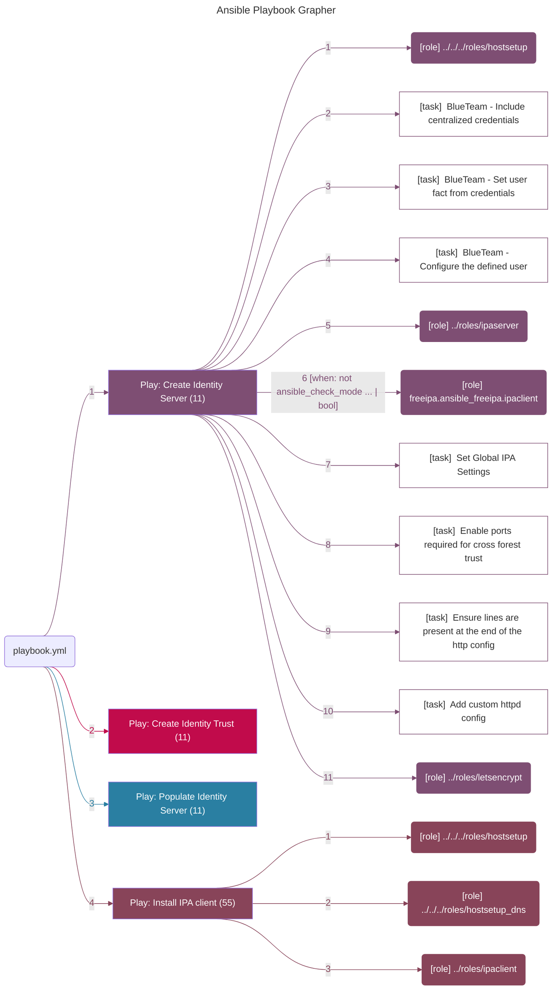

```mermaid
---
title: Ansible Playbook Grapher
---
%%{ init: { "flowchart": { "curve": "bumpX" } } }%%
flowchart LR
	%% Start of the playbook 'playbook.yml'
	playbook_d0f056fc("playbook.yml")
		%% Start of the play 'Play: Create Identity Server (11)'
		play_3a2f58f6["Play: Create Identity Server (11)"]
		style play_3a2f58f6 fill:#7e4e73,color:#ffffff
		playbook_d0f056fc --> |"1"| play_3a2f58f6
		linkStyle 0 stroke:#7e4e73,color:#7e4e73
			%% Start of the role '../../../roles/hostsetup'
			play_3a2f58f6 --> |"1"| role_1a28397d
			linkStyle 1 stroke:#7e4e73,color:#7e4e73
			role_1a28397d("[role] ../../../roles/hostsetup")
			style role_1a28397d fill:#7e4e73,color:#ffffff,stroke:#7e4e73
			%% End of the role '../../../roles/hostsetup'
			task_da1fa6b3["[task]  BlueTeam - Include centralized credentials"]
			style task_da1fa6b3 stroke:#7e4e73,fill:#ffffff
			play_3a2f58f6 --> |"2"| task_da1fa6b3
			linkStyle 2 stroke:#7e4e73,color:#7e4e73
			task_48fb60d4["[task]  BlueTeam - Set user fact from credentials"]
			style task_48fb60d4 stroke:#7e4e73,fill:#ffffff
			play_3a2f58f6 --> |"3"| task_48fb60d4
			linkStyle 3 stroke:#7e4e73,color:#7e4e73
			task_9a6f8295["[task]  BlueTeam - Configure the defined user"]
			style task_9a6f8295 stroke:#7e4e73,fill:#ffffff
			play_3a2f58f6 --> |"4"| task_9a6f8295
			linkStyle 4 stroke:#7e4e73,color:#7e4e73
			%% Start of the role '../roles/ipaserver'
			play_3a2f58f6 --> |"5"| role_069c8127
			linkStyle 5 stroke:#7e4e73,color:#7e4e73
			role_069c8127("[role] ../roles/ipaserver")
			style role_069c8127 fill:#7e4e73,color:#ffffff,stroke:#7e4e73
			%% End of the role '../roles/ipaserver'
			%% Start of the role 'freeipa.ansible_freeipa.ipaclient'
			play_3a2f58f6 --> |"6 [when: not ansible_check_mode ... | bool]"| role_cc7daa72
			linkStyle 6 stroke:#7e4e73,color:#7e4e73
			role_cc7daa72("[role] freeipa.ansible_freeipa.ipaclient")
			style role_cc7daa72 fill:#7e4e73,color:#ffffff,stroke:#7e4e73
			%% End of the role 'freeipa.ansible_freeipa.ipaclient'
			task_d2617a07["[task]  Set Global IPA Settings"]
			style task_d2617a07 stroke:#7e4e73,fill:#ffffff
			play_3a2f58f6 --> |"7"| task_d2617a07
			linkStyle 7 stroke:#7e4e73,color:#7e4e73
			task_17b26e5d["[task]  Enable ports required for cross forest trust"]
			style task_17b26e5d stroke:#7e4e73,fill:#ffffff
			play_3a2f58f6 --> |"8"| task_17b26e5d
			linkStyle 8 stroke:#7e4e73,color:#7e4e73
			task_1fc168bf["[task]  Ensure lines are present at the end of the http config"]
			style task_1fc168bf stroke:#7e4e73,fill:#ffffff
			play_3a2f58f6 --> |"9"| task_1fc168bf
			linkStyle 9 stroke:#7e4e73,color:#7e4e73
			task_1ba4f90b["[task]  Add custom httpd config"]
			style task_1ba4f90b stroke:#7e4e73,fill:#ffffff
			play_3a2f58f6 --> |"10"| task_1ba4f90b
			linkStyle 10 stroke:#7e4e73,color:#7e4e73
			%% Start of the role '../roles/letsencrypt'
			play_3a2f58f6 --> |"11"| role_c8034fd2
			linkStyle 11 stroke:#7e4e73,color:#7e4e73
			role_c8034fd2("[role] ../roles/letsencrypt")
			style role_c8034fd2 fill:#7e4e73,color:#ffffff,stroke:#7e4e73
			%% End of the role '../roles/letsencrypt'
		%% End of the play 'Play: Create Identity Server (11)'
		%% Start of the play 'Play: Create Identity Trust (11)'
		play_b77abe89["Play: Create Identity Trust (11)"]
		style play_b77abe89 fill:#c10b4b,color:#ffffff
		playbook_d0f056fc --> |"2"| play_b77abe89
		linkStyle 12 stroke:#c10b4b,color:#c10b4b
		%% End of the play 'Play: Create Identity Trust (11)'
		%% Start of the play 'Play: Populate Identity Server (11)'
		play_c4e266a3["Play: Populate Identity Server (11)"]
		style play_c4e266a3 fill:#2a7fa2,color:#ffffff
		playbook_d0f056fc --> |"3"| play_c4e266a3
		linkStyle 13 stroke:#2a7fa2,color:#2a7fa2
		%% End of the play 'Play: Populate Identity Server (11)'
		%% Start of the play 'Play: Install IPA client (55)'
		play_82e8bff6["Play: Install IPA client (55)"]
		style play_82e8bff6 fill:#884459,color:#ffffff
		playbook_d0f056fc --> |"4"| play_82e8bff6
		linkStyle 14 stroke:#884459,color:#884459
			%% Start of the role '../../../roles/hostsetup'
			play_82e8bff6 --> |"1"| role_88c4e848
			linkStyle 15 stroke:#884459,color:#884459
			role_88c4e848("[role] ../../../roles/hostsetup")
			style role_88c4e848 fill:#884459,color:#ffffff,stroke:#884459
			%% End of the role '../../../roles/hostsetup'
			%% Start of the role '../../../roles/hostsetup_dns'
			play_82e8bff6 --> |"2"| role_ff5e8a27
			linkStyle 16 stroke:#884459,color:#884459
			role_ff5e8a27("[role] ../../../roles/hostsetup_dns")
			style role_ff5e8a27 fill:#884459,color:#ffffff,stroke:#884459
			%% End of the role '../../../roles/hostsetup_dns'
			%% Start of the role '../roles/ipaclient'
			play_82e8bff6 --> |"3"| role_6c834a0f
			linkStyle 17 stroke:#884459,color:#884459
			role_6c834a0f("[role] ../roles/ipaclient")
			style role_6c834a0f fill:#884459,color:#ffffff,stroke:#884459
			%% End of the role '../roles/ipaclient'
		%% End of the play 'Play: Install IPA client (55)'
	%% End of the playbook 'playbook.yml'


```