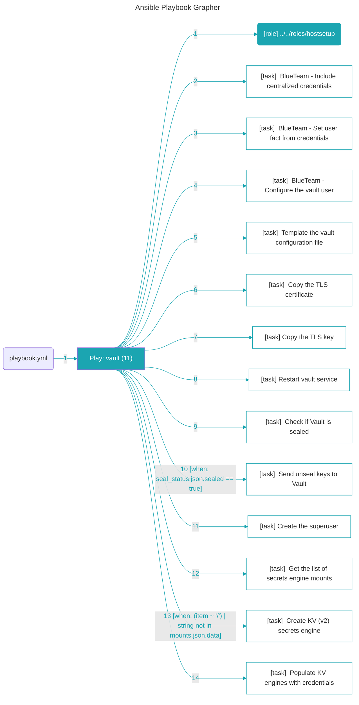

Post Vault
=========

```mermaid
---
title: Ansible Playbook Grapher
---
%%{ init: { "flowchart": { "curve": "bumpX" } } }%%
flowchart LR
	%% Start of the playbook 'playbook.yml'
	playbook_417d0057("playbook.yml")
		%% Start of the play 'Play: vault (11)'
		play_ae8e2521["Play: vault (11)"]
		style play_ae8e2521 fill:#1ba5b1,color:#ffffff
		playbook_417d0057 --> |"1"| play_ae8e2521
		linkStyle 0 stroke:#1ba5b1,color:#1ba5b1
			%% Start of the role '../../roles/hostsetup'
			play_ae8e2521 --> |"1"| role_cfce24bd
			linkStyle 1 stroke:#1ba5b1,color:#1ba5b1
			role_cfce24bd("[role] ../../roles/hostsetup")
			style role_cfce24bd fill:#1ba5b1,color:#ffffff,stroke:#1ba5b1
			%% End of the role '../../roles/hostsetup'
			task_d314fb1b["[task]  BlueTeam - Include centralized credentials"]
			style task_d314fb1b stroke:#1ba5b1,fill:#ffffff
			play_ae8e2521 --> |"2"| task_d314fb1b
			linkStyle 2 stroke:#1ba5b1,color:#1ba5b1
			task_fe7059f3["[task]  BlueTeam - Set user fact from credentials"]
			style task_fe7059f3 stroke:#1ba5b1,fill:#ffffff
			play_ae8e2521 --> |"3"| task_fe7059f3
			linkStyle 3 stroke:#1ba5b1,color:#1ba5b1
			task_4bf5c583["[task]  BlueTeam - Configure the vault user"]
			style task_4bf5c583 stroke:#1ba5b1,fill:#ffffff
			play_ae8e2521 --> |"4"| task_4bf5c583
			linkStyle 4 stroke:#1ba5b1,color:#1ba5b1
			task_0c10ce2c["[task]  Template the vault configuration file"]
			style task_0c10ce2c stroke:#1ba5b1,fill:#ffffff
			play_ae8e2521 --> |"5"| task_0c10ce2c
			linkStyle 5 stroke:#1ba5b1,color:#1ba5b1
			task_bd212ffc["[task]  Copy the TLS certificate"]
			style task_bd212ffc stroke:#1ba5b1,fill:#ffffff
			play_ae8e2521 --> |"6"| task_bd212ffc
			linkStyle 6 stroke:#1ba5b1,color:#1ba5b1
			task_cedf4ea7["[task]  Copy the TLS key"]
			style task_cedf4ea7 stroke:#1ba5b1,fill:#ffffff
			play_ae8e2521 --> |"7"| task_cedf4ea7
			linkStyle 7 stroke:#1ba5b1,color:#1ba5b1
			task_bf7c9ffa["[task]  Restart vault service"]
			style task_bf7c9ffa stroke:#1ba5b1,fill:#ffffff
			play_ae8e2521 --> |"8"| task_bf7c9ffa
			linkStyle 8 stroke:#1ba5b1,color:#1ba5b1
			task_405d4dcc["[task]  Check if Vault is sealed"]
			style task_405d4dcc stroke:#1ba5b1,fill:#ffffff
			play_ae8e2521 --> |"9"| task_405d4dcc
			linkStyle 9 stroke:#1ba5b1,color:#1ba5b1
			task_a5d6a016["[task]  Send unseal keys to Vault"]
			style task_a5d6a016 stroke:#1ba5b1,fill:#ffffff
			play_ae8e2521 --> |"10 [when: seal_status.json.sealed == true]"| task_a5d6a016
			linkStyle 10 stroke:#1ba5b1,color:#1ba5b1
			task_5798b12a["[task]  Create the superuser"]
			style task_5798b12a stroke:#1ba5b1,fill:#ffffff
			play_ae8e2521 --> |"11"| task_5798b12a
			linkStyle 11 stroke:#1ba5b1,color:#1ba5b1
			task_d6dd9373["[task]  Get the list of secrets engine mounts"]
			style task_d6dd9373 stroke:#1ba5b1,fill:#ffffff
			play_ae8e2521 --> |"12"| task_d6dd9373
			linkStyle 12 stroke:#1ba5b1,color:#1ba5b1
			task_1be8af6c["[task]  Create KV (v2) secrets engine"]
			style task_1be8af6c stroke:#1ba5b1,fill:#ffffff
			play_ae8e2521 --> |"13 [when: (item ~ '/') | string not in mounts.json.data]"| task_1be8af6c
			linkStyle 13 stroke:#1ba5b1,color:#1ba5b1
			task_69186138["[task]  Populate KV engines with credentials"]
			style task_69186138 stroke:#1ba5b1,fill:#ffffff
			play_ae8e2521 --> |"14"| task_69186138
			linkStyle 14 stroke:#1ba5b1,color:#1ba5b1
		%% End of the play 'Play: vault (11)'
	%% End of the playbook 'playbook.yml'


```