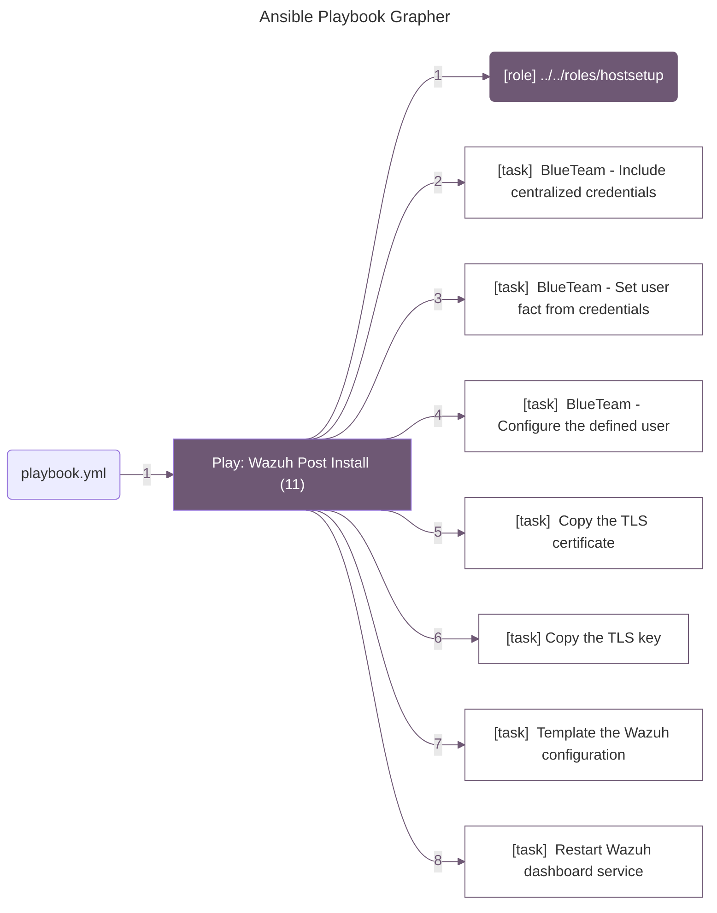

Post Wazuh
=========

The post configuration for Wazuh handles setting up the Wazuh server, populating the Wazuh server with agents, etc.

Ansible Variables
--------------

Ansible Roles
------------
The following roles are used for the post configuration of Wazuh:

- []

Entry Points
------------

### Main Entry Point

The [playbook.yaml](/ansible/regionals/post/Wazuh/playbooks/domain_create.yaml) file is the main entry point for the post configuration of the Wazuh regionals. This file imports multiple playbooks to handle the different aspects of the post configuration. The playbooks are located in the [playbooks](/ansible/regionals/post/Wazuh/playbooks/) directory. 

#### Domain Creation

The playbook [domain_create.yaml](/ansible/regionals/post/Wazuh/playbooks/domain_create.yaml) handles configuring **win_dc** to establish a new Active Directory domain. It performs the following tasks:

- Set NTP server
- Set Timezone to EST
- Updates Hostname
- Install Active Directory Domain Services
- Creates `black-team` user

