Post Windows
=========

The post configuration for windows handles the creation and configuration of the Active Directory domain, setting up domain clients, populating, etc.

Ansible Variables
--------------

The following variables, which are set in [02-windows.yaml](/ansible/regionals/inventory/02-windows.yaml) are used for windows post configuration:

- **adserver_domain**: The domain name of the Active Directory server.
- **adserver_password**: The user password for connecting to the Windows server and the DSRM password.
- **ansible_connection**: For Windows hosts, set to `winrm`.
- **ansible_user**: The username used by Ansible for authentication when connecting to the target host.
- **ansible_password**: {{ adserver_password }}
- **ansible_winrm_connection_timeout**: The time (secs) to wait for the initial WinRM connection.
- **ansible_winrm_operation_timeout_sec**: The time (secs) to wait for each WinRM operation to complete.
- **ansible_winrm_read_timeout_sec**: The time (secs) to wait for a response during read operation.
- **ansible_winrm_server_cert_validation**: Specifies whether to validate the SSL/TLS certificate.
- **ansible_winrm_transport**: Specifies the transport mechanism used by WinRM for communication. Common options include `ntlm`, `kerberos`, and `ssl`.

Entry Points
------------

### Main Entry Point

The [playbook.yaml](/ansible/regionals/post/windows/playbooks/domain_create.yaml) file is the main entry point for the post configuration of the Windows regionals. This file imports multiple playbooks to handle the different aspects of the post configuration. The playbooks are located in the [playbooks](/ansible/regionals/post/windows/playbooks/) directory. 

#### Domain Creation

The playbook [domain_create.yaml](/ansible/regionals/post/windows/playbooks/domain_create.yaml) handles configuring **win_dc** to establish a new Active Directory domain. It performs the following tasks:

- Set NTP server
- Set Timezone to EST
- Updates Hostname
- Install Active Directory Domain Services
- Creates `black-team` user

#### Populating the Domain

The playbook [domain_populate.yaml](/ansible/regionals/post/windows/playbooks/domain_populate.yaml) handles populating the Active Directory domain. It performs the following tasks:

- Setup DNS Forwarder for Identity
- Create Users, Groups, and Organizational Units from CSV
- Imports GPOs
- Configures BGInfo
- Create gMSA users

#### Domain Join

The playbook [domain_join.yaml](/ansible/regionals/post/windows/playbooks/domain_join.yaml) handles joining the Windows clients to the Active Directory domain. It performs the following tasks:

- Sets DNS to point to the domain controller
- Sets Timezone to EST
- Updates Hostname
- Joins the domain

#### Setup CA
The playbook [setup_ca.yaml](/ansible/regionals/post/windows/playbooks/setup_ca.yaml) handles setting up the Certificate Authority. It performs the following tasks:

- Copy CA certificate to server
- Adds ADCS feature
- Setup CA with previously copied certificate
- Adds ADCS web enrollment feature

```mermaid
---
title: Ansible Playbook Grapher
---
%%{ init: { "flowchart": { "curve": "bumpX" } } }%%
flowchart LR
	%% Start of the playbook 'playbook.yaml'
	playbook_dfcc3623("playbook.yaml")
		%% Start of the play 'Play: domain_create.yaml (11)'
		play_b14a4171["Play: domain_create.yaml (11)"]
		style play_b14a4171 fill:#7c6150,color:#ffffff
		playbook_dfcc3623 --> |"1"| play_b14a4171
		linkStyle 0 stroke:#7c6150,color:#7c6150
			task_106d4ce1["[task]  set ntp servers"]
			style task_106d4ce1 stroke:#7c6150,fill:#ffffff
			play_b14a4171 --> |"1"| task_106d4ce1
			linkStyle 1 stroke:#7c6150,color:#7c6150
			task_7cecf600["[task]  Configure Time Zone to Eastern Standard Time"]
			style task_7cecf600 stroke:#7c6150,fill:#ffffff
			play_b14a4171 --> |"2"| task_7cecf600
			linkStyle 2 stroke:#7c6150,color:#7c6150
			task_69251b40["[task]  Update Hostname Configuration"]
			style task_69251b40 stroke:#7c6150,fill:#ffffff
			play_b14a4171 --> |"3"| task_69251b40
			linkStyle 3 stroke:#7c6150,color:#7c6150
			task_c22a5945["[task]  Reboot Host to Apply Hostname Changes"]
			style task_c22a5945 stroke:#7c6150,fill:#ffffff
			play_b14a4171 --> |"4 [when: res_win_hostname.reboot_required]"| task_c22a5945
			linkStyle 4 stroke:#7c6150,color:#7c6150
			task_f30cb1cc["[task]  Establish New Active Directory Domain"]
			style task_f30cb1cc stroke:#7c6150,fill:#ffffff
			play_b14a4171 --> |"5"| task_f30cb1cc
			linkStyle 5 stroke:#7c6150,color:#7c6150
			task_182c1f2d["[task]  Reboot host if install requires it"]
			style task_182c1f2d stroke:#7c6150,fill:#ffffff
			play_b14a4171 --> |"6 [when: domain_create.reboot_required]"| task_182c1f2d
			linkStyle 6 stroke:#7c6150,color:#7c6150
			task_e8d4608a["[task]  Create black-team user"]
			style task_e8d4608a stroke:#7c6150,fill:#ffffff
			play_b14a4171 --> |"7"| task_e8d4608a
			linkStyle 7 stroke:#7c6150,color:#7c6150
		%% End of the play 'Play: domain_create.yaml (11)'
		%% Start of the play 'Play: Automated Setup of Active Directory Users and Groups (11)'
		play_bc1bf46f["Play: Automated Setup of Active Directory Users and Groups (11)"]
		style play_bc1bf46f fill:#a9235e,color:#ffffff
		playbook_dfcc3623 --> |"2"| play_bc1bf46f
		linkStyle 8 stroke:#a9235e,color:#a9235e
			task_082447da["[task]  Setup DNS Forwarder for Identity"]
			style task_082447da stroke:#a9235e,fill:#ffffff
			play_bc1bf46f --> |"1"| task_082447da
			linkStyle 9 stroke:#a9235e,color:#a9235e
			task_2acf1580["[task]  Transfer User Data CSV to Target Server"]
			style task_2acf1580 stroke:#a9235e,fill:#ffffff
			play_bc1bf46f --> |"2"| task_2acf1580
			linkStyle 10 stroke:#a9235e,color:#a9235e
			task_bc8ed73e["[task]  Transfer GPOs to Target Server"]
			style task_bc8ed73e stroke:#a9235e,fill:#ffffff
			play_bc1bf46f --> |"3"| task_bc8ed73e
			linkStyle 11 stroke:#a9235e,color:#a9235e
			task_33aa9621["[task]  Transfer BGInfo to Target Server"]
			style task_33aa9621 stroke:#a9235e,fill:#ffffff
			play_bc1bf46f --> |"4"| task_33aa9621
			linkStyle 12 stroke:#a9235e,color:#a9235e
			task_b75bd999["[task]  Extract BGInfo"]
			style task_b75bd999 stroke:#a9235e,fill:#ffffff
			play_bc1bf46f --> |"5"| task_b75bd999
			linkStyle 13 stroke:#a9235e,color:#a9235e
			task_f06e15e5["[task]  Ensure GPO features are installed"]
			style task_f06e15e5 stroke:#a9235e,fill:#ffffff
			play_bc1bf46f --> |"6"| task_f06e15e5
			linkStyle 14 stroke:#a9235e,color:#a9235e
			task_f5fd09c3["[task]  Run Active Directory Configuration Script"]
			style task_f5fd09c3 stroke:#a9235e,fill:#ffffff
			play_bc1bf46f --> |"7"| task_f5fd09c3
			linkStyle 15 stroke:#a9235e,color:#a9235e
			task_cfdab881["[task]  debug"]
			style task_cfdab881 stroke:#a9235e,fill:#ffffff
			play_bc1bf46f --> |"8"| task_cfdab881
			linkStyle 16 stroke:#a9235e,color:#a9235e
			task_26efdc84["[task]  Clean up: Remove CSV File from Server"]
			style task_26efdc84 stroke:#a9235e,fill:#ffffff
			play_bc1bf46f --> |"9"| task_26efdc84
			linkStyle 17 stroke:#a9235e,color:#a9235e
			task_2bfd8630["[task]  Clean up: Remove Temp Folder from Server"]
			style task_2bfd8630 stroke:#a9235e,fill:#ffffff
			play_bc1bf46f --> |"10"| task_2bfd8630
			linkStyle 18 stroke:#a9235e,color:#a9235e
		%% End of the play 'Play: Automated Setup of Active Directory Users and Groups (11)'
		%% Start of the play 'Play: Domain Join for Windows Servers and Workstations (44)'
		play_4d4d1812["Play: Domain Join for Windows Servers and Workstations (44)"]
		style play_4d4d1812 fill:#af551d,color:#ffffff
		playbook_dfcc3623 --> |"3"| play_4d4d1812
		linkStyle 19 stroke:#af551d,color:#af551d
			task_089e9337["[task]  Update DNS Server Configuration"]
			style task_089e9337 stroke:#af551d,fill:#ffffff
			play_4d4d1812 --> |"1"| task_089e9337
			linkStyle 20 stroke:#af551d,color:#af551d
			task_0f1fb6bc["[task]  Set Server Time Zone to Eastern Standard Time"]
			style task_0f1fb6bc stroke:#af551d,fill:#ffffff
			play_4d4d1812 --> |"2"| task_0f1fb6bc
			linkStyle 21 stroke:#af551d,color:#af551d
			task_9adfad7c["[task]  Update Hostname to Align with Inventory Naming"]
			style task_9adfad7c stroke:#af551d,fill:#ffffff
			play_4d4d1812 --> |"3"| task_9adfad7c
			linkStyle 22 stroke:#af551d,color:#af551d
			task_7cfd7175["[task]  Initiate Reboot if Hostname Update Requires"]
			style task_7cfd7175 stroke:#af551d,fill:#ffffff
			play_4d4d1812 --> |"4 [when: result_hostname.reboot_required]"| task_7cfd7175
			linkStyle 23 stroke:#af551d,color:#af551d
			task_7eef21ca["[task]  Join Object to Active Directory Domain"]
			style task_7eef21ca stroke:#af551d,fill:#ffffff
			play_4d4d1812 --> |"5"| task_7eef21ca
			linkStyle 24 stroke:#af551d,color:#af551d
			task_02def5b5["[task]  Reboot Post Domain Join if Required"]
			style task_02def5b5 stroke:#af551d,fill:#ffffff
			play_4d4d1812 --> |"6 [when: result_domain.reboot_required]"| task_02def5b5
			linkStyle 25 stroke:#af551d,color:#af551d
		%% End of the play 'Play: Domain Join for Windows Servers and Workstations (44)'
		%% Start of the play 'Play: Configure Windows CA (11)'
		play_f93a08a1["Play: Configure Windows CA (11)"]
		style play_f93a08a1 fill:#b2381a,color:#ffffff
		playbook_dfcc3623 --> |"4"| play_f93a08a1
		linkStyle 26 stroke:#b2381a,color:#b2381a
			%% Start of the role '../roles/configure/adcs'
			play_f93a08a1 --> |"1"| role_1ce93802
			linkStyle 27 stroke:#b2381a,color:#b2381a
			role_1ce93802("[role] ../roles/configure/adcs")
			style role_1ce93802 fill:#b2381a,color:#ffffff,stroke:#b2381a
			%% End of the role '../roles/configure/adcs'
			%% Start of the role '../roles/configure/adcs_template'
			play_f93a08a1 --> |"2"| role_102c07e9
			linkStyle 28 stroke:#b2381a,color:#b2381a
			role_102c07e9("[role] ../roles/configure/adcs_template")
			style role_102c07e9 fill:#b2381a,color:#ffffff,stroke:#b2381a
			%% End of the role '../roles/configure/adcs_template'
		%% End of the play 'Play: Configure Windows CA (11)'
		%% Start of the play 'Play: Configure Windows IIS (11)'
		play_e8c9d011["Play: Configure Windows IIS (11)"]
		style play_e8c9d011 fill:#bb114a,color:#ffffff
		playbook_dfcc3623 --> |"5"| play_e8c9d011
		linkStyle 29 stroke:#bb114a,color:#bb114a
			task_535d3798["[task]  Request a certificate"]
			style task_535d3798 stroke:#bb114a,fill:#ffffff
			play_e8c9d011 --> |"1"| task_535d3798
			linkStyle 30 stroke:#bb114a,color:#bb114a
			task_2b65c560["[task]  Add a HTTPS binding"]
			style task_2b65c560 stroke:#bb114a,fill:#ffffff
			play_e8c9d011 --> |"2"| task_2b65c560
			linkStyle 31 stroke:#bb114a,color:#bb114a
		%% End of the play 'Play: Configure Windows IIS (11)'
	%% End of the playbook 'playbook.yaml'

```

